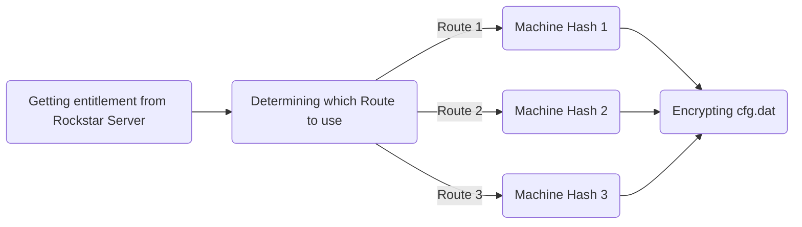
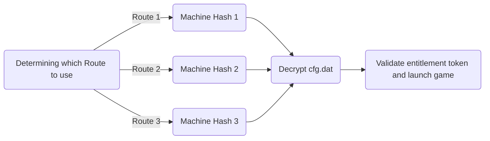

# Social Club Launch

## Credits:

The following information are only known due to massive reverse-engineering efforts from @Special For and @dr490n. I'm just the messenger. 

And while other community members probably contributed ideas and pieces of the puzzle during the community-driven research to fix the downgrade issue back in 2020, we would not have the deep understanding, nor the solution to the problem, without @Special For and @dr490n.

## Basics

Normally, when you launch GTA V, you connect to Rockstar servers, they verify that your account owns GTA, and your game will boot successfully. So far so good.

Now this worked fine for many years, even on downgraded GTA Versions. However, in order to downgrade GTA, you also have to downgrade Social Club.  

At some point Rockstar changed something server-side and stopped verifying game-ownership for old and outdated Social Club versions.

This meant that the offline authentication comes into play.

## Rockstars solution to an offline game launch

How Rockstars offline authentication works is quite simple. If you have internet and launch the game, Rockstar gets your `entitlement token` (verifying you own GTA and are eligible to play it) from Rockstar servers. It then takes one of three Routes, generates your `machine hash` (something unique to your computer and your computer only) and encrypts (using your machine hash) your aforementioned `entitlement token` and saves it into a file called cfg.dat.

Up-to-date online GTA, generating cfg.dat:

Now, when you launch the game offline, it was designed to (again) determine with Route it would use, use the **SAME ROUTE** as it did before, and generate the **SAME MACHINE HASH** as it did before, before decrypting the cfg.dat with the generated machine hash, validating the session (mainly by checking if a timestamp included in the decrypted cfg.dat is in the past or not) and launches the game.

Offline GTA, trying to offline-launch the game:

Now this worked fine (as designed) for many years. 
At some point, the latest social club was not compatible with old GTA versions and you needed to downgrade social club to launch downgraded GTA V. 
At some other point rockstar stopped verifying game ownership (entitlement) for old game  social club versions and gives you an error message about outdated socialclub / rockstar games launcher and tries to auto-update. 
To stop this from happening, people started putting steam in offline mode or launching GTA with the `-scOfflineOnly` command line argument.
(Note: I actually do not know which of these issues came first, and cant be bothered investigating)  

## The issues with that on old game versions:

This is also fine and works as intended, but there are two small issues when you attempt to do an offline-launch on old (1.24 and 1.27) GTA V:

A)  Rockstar changed the algorithm for generating machine hash inside route 3 (around 2015)
* Meaning even though route 3 is selected when you generate cfg.dat while connected to rockstar servers, and the same route 3 is selected when you do an offline launch, the **machine hashes generated are different**.
* This is because when generating/encrypting cfg.dat the "new" machine hash algorithm is used, but when reading/decrypting cfg.dat the "old" machine hash algorithm from the old GTA V version is used.
* Different machine hashes lead to an un-readable cfg.dat and a game that fails to launch.
* (Fun fact: this was changed in 1.28)
 
 B) Rockstar changed the route selection
 * It used to be a combination of windows username and your local $PATH Windows variable
 * Now its just your rockstar-account-ID
 * This however means that when getting a route for decrypting / reading cfg.dat, you may end up with a **different route** than you had when you encrypted / generated cfg.dat. 
 * Meaning you have a 2/3 chance of a failed offline game launch, because you cant decrypt cfg.dat, because you will have non-matching machine hashes due to the different route.

Steams users were NOT affected by these issues until 2020, because they did NOT have to use offline verification until then.

## @Specials For's Magic:

So what do we do to achieve a working downgraded offline game launch on game versions 1.24 and 1.27?

Problem A) was a surprisingly easy fix.

* The GTAVLauncher.exe from game version 1.33 already has the "new" route 3 machine hash algorithm. Turns out GTAVLauncher.exe from game version 1.33 also has no issues launching game versions 1.24 and 1.27, so we just use a "new-ish-enough" GTAVLauncher.

* gta5.exe also has both the route selector and the three machine hash algorithms, so for route 3 we just pass the machine hash generated inside gtavlauncher.exe to gta5.exe via command line args and patched gta5.exe to use the machine hash from the command line arguments instead of letting gta5.exe generate it.

Problem B) Is a bit more tricky.

* For the past few years (before we were aware of the changed route 3), we just forced gtavlauncher to pick route 1, see if it works, and if not close itself and try again with route 2 (and if that also results in a failed game launch, try again with forced route 3).
* Now, we just used the route-selection from an up-to-date GTA, and re-implemented it into the old gtavlauncher.exe (and gta5.exe)

----
#### This results in a downgraded GTA V that should work for everyone, but still    
a) requires you to actually own the game  
b) verifies rockstars entitlement (`cfg.dat`)  
c) needs you to have the same machine hash as you had when you last launched an up-to-date GTA with internet access  

----

#### Can this break?   

Yes. Rockstar can break this by changing a machine hash algorithm, changing the route selection, adding more routes, not supporting offline game launches at all by not writing entitle token to file anymore etc.

Do we think they will do that? No.
